# Design Patterns Summary

## 1. Resource Acquisition Is Initialization (RAII)

**Тип шаблону:** Породжуючий (Creational Pattern)  
**Призначення:** Автоматичне управління ресурсами через життєвий цикл об’єкта  
**Джерело:** [Концепция RAII](https://habr.com/ru/companies/otus/articles/778942/)

### Опис:
RAII (Resource Acquisition Is Initialization) — це концепція, за якої ресурс прив’язується до об'єкта: він виділяється при створенні об'єкта та автоматично звільняється при його знищенні. Це забезпечує безпечне та надійне управління ресурсами без необхідності ручного контролю.

RAII допомагає уникати утечок пам’яті, неправильного закриття файлів і помилок у роботі з ресурсами. Особливо корисною ця концепція є в умовах виникнення виключень, адже ресурси гарантовано звільняються деструкторами, навіть якщо сталася помилка.

Код із використанням RAII стає чистішим і зрозумілішим: логіка управління ресурсами інкапсульована в об'єктах, що спрощує супровід і знижує ризик помилок. RAII підходить для роботи з пам’яттю, файлами, з’єднаннями та іншими ресурсами, зокрема й у багатопотокових середовищах.

Завдяки цій концепції створювати надійні програми простіше — ресурси використовуються ефективно, а звільнення відбувається автоматично й безпечно.

### Основні складові:
- **Resource** — ресурс, який потрібно отримати (наприклад, файл, з'єднання, м'ютекс).
- **RAIIWrapper** — клас-обгортка, який:
  - у **конструкторі** викликає `acquire()` — ініціалізує ресурс
  - у **деструкторі** викликає `release()` — звільняє ресурс
- **Клієнтський код** — створює об’єкт `RAIIWrapper` і більше не хвилюється про звільнення ресурсу.

### UML-діаграми
**Діаграма класів**  
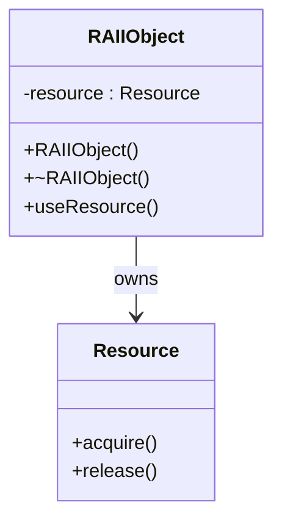

**Діаграма взаємодії**  
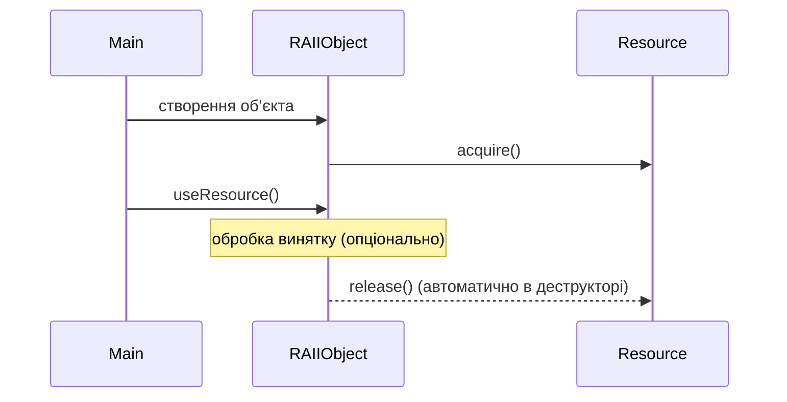

**Діаграма станів**
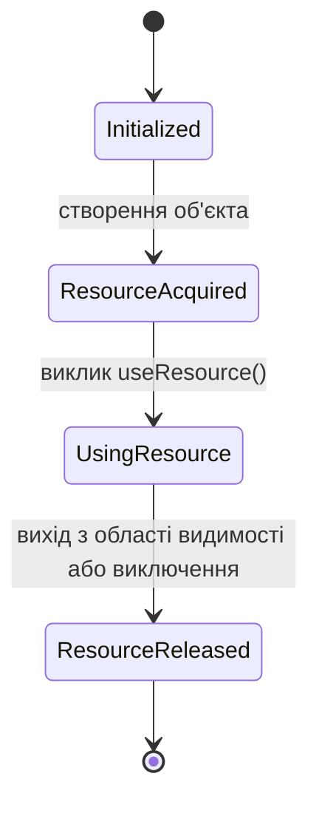

## 2. Decorator

**Тип шаблону:** Структурний (Structural Pattern)  
**Призначення:** Дає змогу динамічно додавати об’єктам нову функціональність, загортаючи їх у корисні «обгортки»  
**Джерело:** [Refactoring Guru - Декоратор](https://refactoring.guru/uk/design-patterns/decorator)

### Опис:
Декоратор дозволяє динамічно додавати об’єктам нову поведінку, не змінюючи їхній код. Це досягається за рахунок обгортання об'єкта в інші об'єкти-декоратори, які реалізують той самий інтерфейс і розширюють або змінюють функціональність.   

**Принцип роботи:**   
1. Створюється базовий об'єкт (ConcreteComponent).   
2. Він обгортається у декоратор (ConcreteDecorator).   
3. Кожен декоратор реалізує ту саму інтерфейсну структуру та додає свою поведінку.   
4. Можна вкладати декоратори один в одного, комбінуючи функціональність.   

### Основні складові:
- **Component (Компонент)** - абстрактний інтерфейс або базовий клас, який визначає стандартну поведінку об'єктів. Визначає контракт, спільний для всіх об'єктів (як основних, так і декораторів).   
- **ConcreteComponent (Конкретний компонент)** - реалізація Component, до якої можна додавати нову функціональність. Основний об'єкт, який буде декоруватися.   
- **Decorator (Декоратор)** - абстрактний клас, що реалізує інтерфейс Component і зберігає посилання на інший Component. Основа для створення декораторів, делегує виклики вкладеному об'єкту.   
- **ConcreteDecorator (Конкретний декоратор)** - клас, що успадковується від Decorator і додає нову поведінку до компонента. Розширює або змінює функціональність, не змінюючи структуру основного класу.

### UML-діаграми   
**Діаграма класів**  
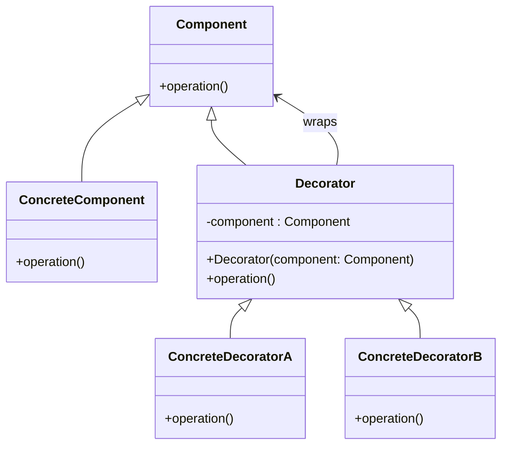

**Діаграма взаємодії**  
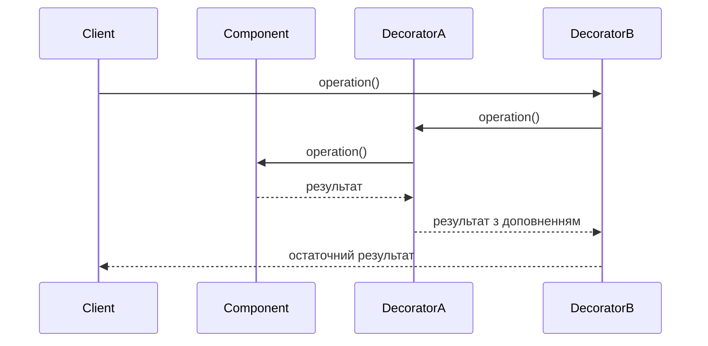

**Діаграма станів**
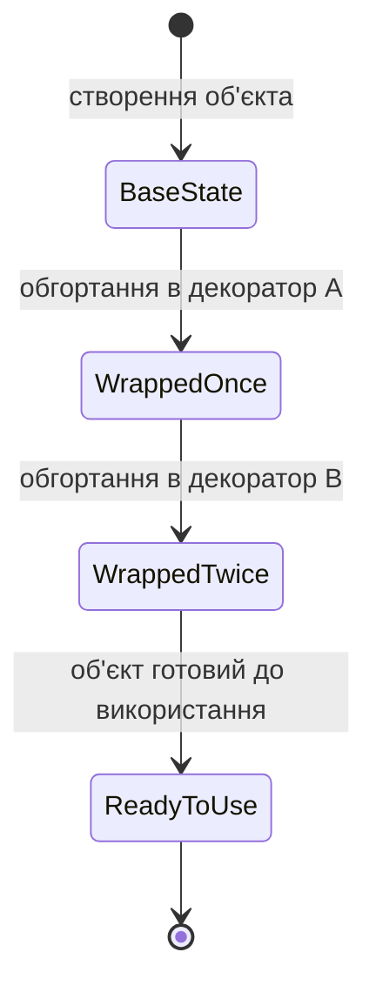

## 3. Protocol Stack

**Тип шаблону:** Поведінковий (Behavioral pattern)  
**Призначення:** Забезпечує гнучке управління шарами протоколу, дозволяючи динамічно додавати або видаляти шари без необхідності змінювати інші частини стеку  
**Джерело:** [Eventhelix - Protocol Stack](https://www.eventhelix.com/design-patterns/protocol-stack/)

### Опис:
У традиційних реалізаціях стеків протоколів шари жорстко пов'язані між собою, що ускладнює їх модифікацію. Шаблон Protocol Stack розв'язує цю проблему, впроваджуючи архітектуру, де шари можуть бути динамічно додані або видалені під час виконання програми.   

**Принцип роботи:**   
1. Protocol Stack реалізується як клас, який підтримує двозв'язний список активних шарів.   
2. Кожен Protocol Layer реалізує стандартний інтерфейс для взаємодії з сусідніми шарами.   
3. Методи `Add_Layer` та `Remove_Laye`r дозволяють динамічно змінювати структуру стеку, додаючи або видаляючи шари в будь-якому місці.  
4. Методи `Handle_Transmit` та `Handle_Receive` забезпечують передачу даних через стек, делегуючи обробку відповідним шарам.   

### Основні складові:
- **Protocol Stack:** Клас, який управляє стеком протоколів, підтримуючи динамічне додавання та видалення шарів.   
- **Protocol Layer:** Базовий клас для всіх шарів протоколу, який визначає інтерфейси для взаємодії з іншими шарами.

### UML-діаграми   
**Діаграма класів**  
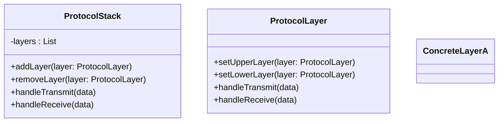

**Діаграма взаємодії**  
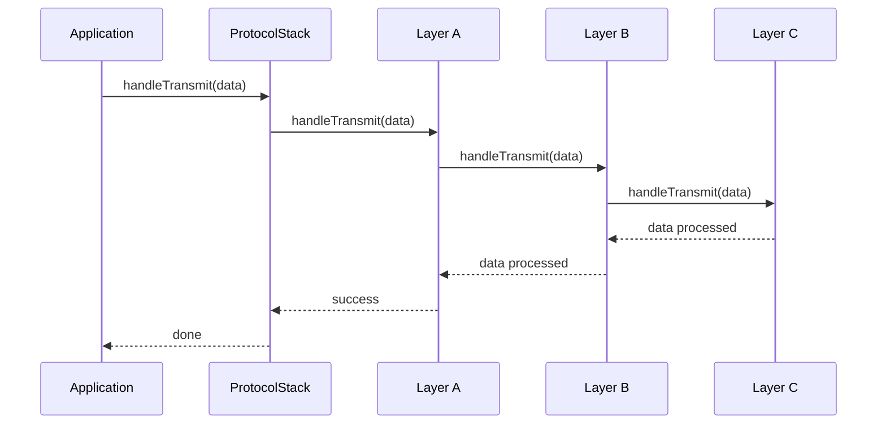

**Діаграма станів**
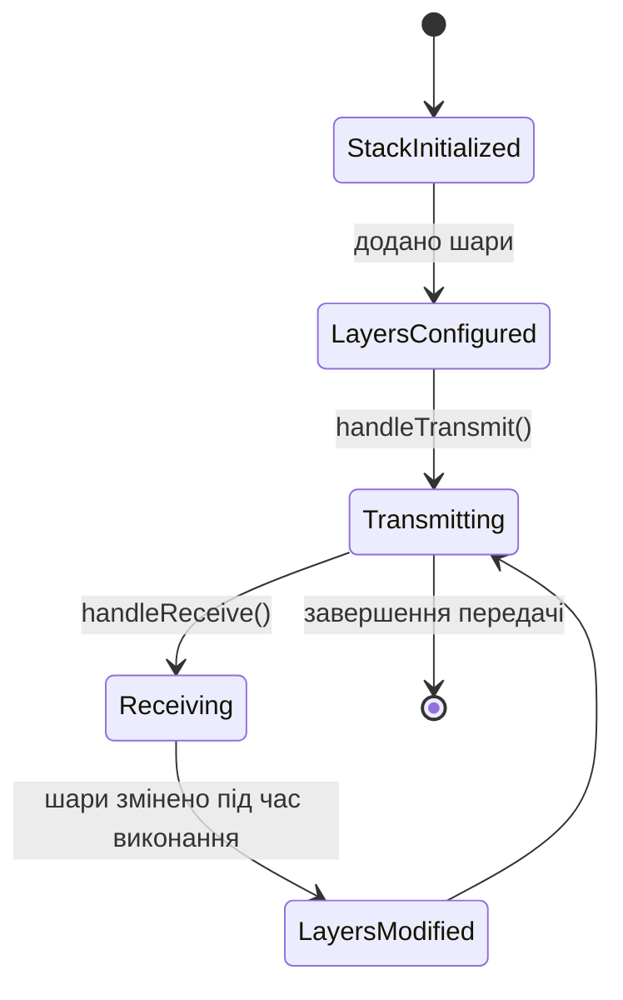

## 4. Lock

**Тип шаблону:** Паралельні обчислення (Concurrency pattern).  
**Призначення:** Контроль одночасного доступу до спільного ресурсу, дозволяє гарантувати, що тільки один потік має доступ до ресурсу в конкретний момент часу  
**Джерело:** [Wikipedia - Lock](https://en.wikipedia.org/wiki/Lock_(computer_science))

### Опис:
Lock (Замикання) — це шаблон синхронізації, який забезпечує взаємне виключення при доступі до спільних ресурсів у багатопотоковому середовищі. Він гарантує, що тільки один потік може одночасно отримати доступ до критичної секції коду або даних, запобігаючи гонкам даних та пошкодженню стану.   
Lock використовується для ізоляції критичних ділянок коду, які не повинні виконуватись одночасно кількома потоками. Це досягається шляхом "захоплення" замка перед виконанням і "звільнення" після завершення. Інші потоки чекають, поки замок стане доступним.   

**Принцип роботи:**   
1. Потік намагається захопити замок (`lock`).   
2. Якщо замок вільний, потік отримує доступ до ресурсу.   
3. Інші потоки блокуються, поки замок не буде звільнений.  
4. Після завершення роботи потік звільняє замок (`unlock`), дозволяючи іншим потокам продовжити.   

### Основні складові:
- **Lock / Mutex / Monitor:** Примітиви синхронізації, які реалізують механізм замикання.   
- **Критична секція (Critical Section):** Фрагмент коду, який виконується під захистом замка.   
- **Condition Variable (опціонально):** Механізм, що дозволяє потокам чекати на певну умову всередині замкненої секції.   

### UML-діаграми   
**Діаграма класів**  
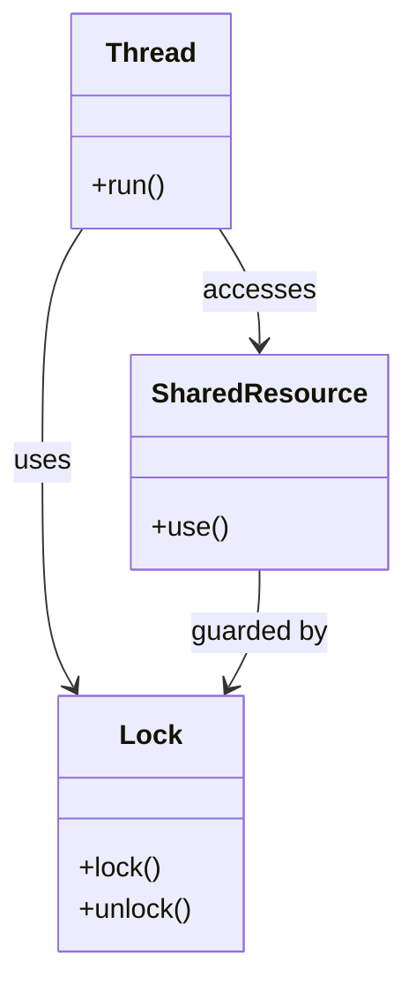

**Діаграма взаємодії**  
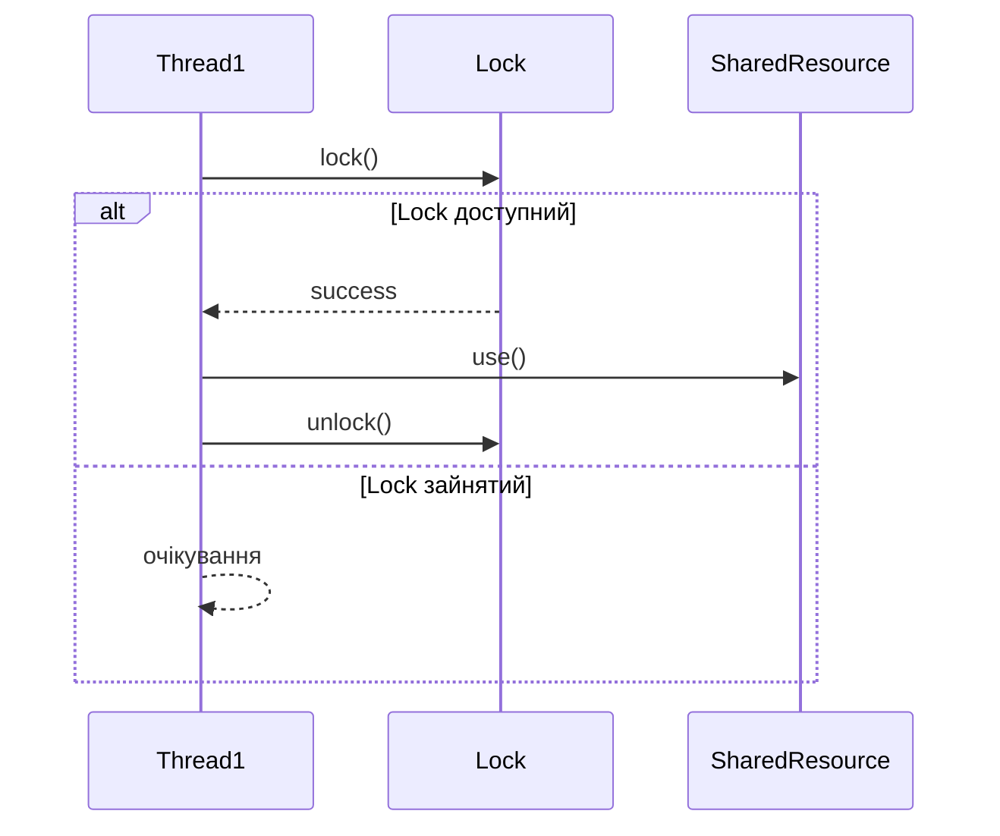

**Діаграма станів**
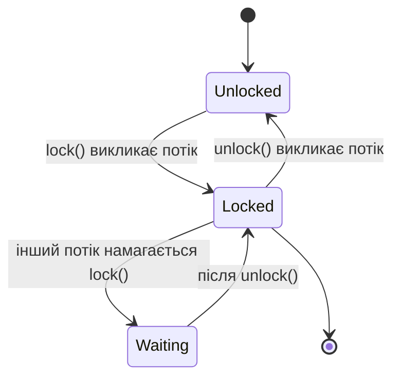
